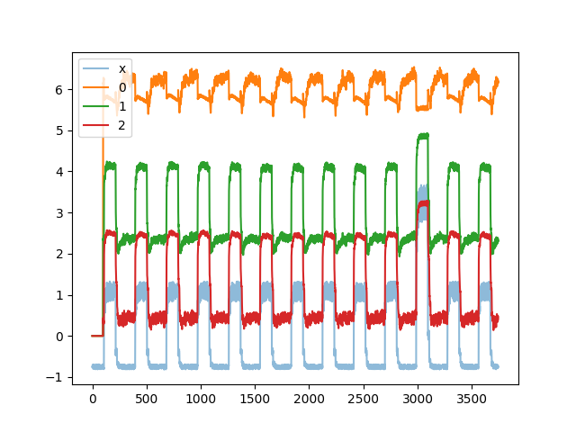
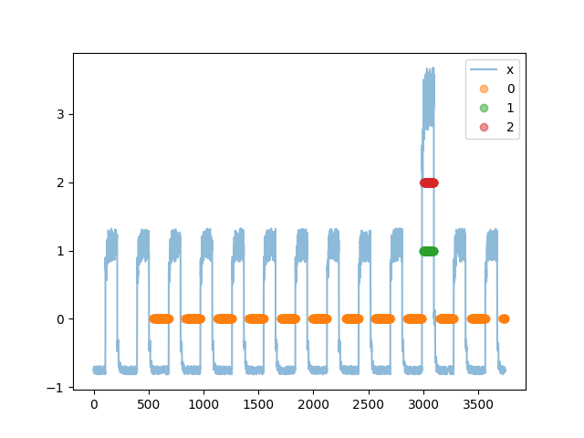

If you look at keras examples, you find one about anomaly detection on time series data\
https://keras.io/examples/timeseries/timeseries_anomaly_detection/
\

If you look through it, you might wonder why it does not use recurrent neuronal networks, but justs cuts parts out of the time series.
Since this ignores every datapoint outside of the current range you expect it to be worse. And since it can only find anomalies after the time range has finished, you expect it to also be almost useless for time critical data.\

So why is it not using recurrent neuronal networks? This is becuase it is based on autoencoders, which require reconstruction of the signal. And since reconstructing data accurately is very hard using a recurrent neuronal network, they choose an alternative way.\

This is my suggestion of using recurrent neuronal networks for the exact same task. I solve it, by using an alternative way of anomaly detection (that I call oneoff networks), that can easily be implemented in a recurrent way. Oneoff networks are defined by their loss (and by them missing biases) so take a look at loss.py for a quick explanation.\

In the folder keras-example you find the original example from 
https://keras.io/examples/timeseries/timeseries_anomaly_detection/ just modified to save the final image (and the data used), while in the rest of this folder, I implement my recurrent oneoff networks on the exact same data.\

Now for the most important question: Does this actually work?\
I think it has merrit, else I would not publish it, but there are some caveats.\
First of all, I could only train a very small network O(1000) parameters, since this already stresses my hardware (this does not mean that recuroo networks are more hardware intensive, but only that I dont have a good training setup at the moment/should have trained this on colab). This means that there could be a lot better anomaly detection possible, and using recuroo you can surely better profit from more hardware than by using autoencoder (deeper autoencoder get worse if the training is not superb, since shallow networks allow for easier (not better!) identities).\
Secondly, is this highly periodically changing data not perfect for recuroo. This you can see in output2.png, as the output of the oo network resemples its input, but it also makes sense when you consider that the trivial oneoff case is a constant input (and this neirly nondifferentiable input is clearly not constant). But this does not matter that much, when we look only at the most anomalous parts of the data. Also it can be mitigated by using more LSTM layers (I am using 2 here).\

For this have a look at output3.png:\

Here I show the regions with the most deviation from the expected one. Since this deviation is continous, I handpick a certain sigma difference to show the effects well. This differences are [3,3.5,3] sigma for the three predictions. I also cut away the first 500 points to allow the network to ignore initial fluctuations (see output2.png again).\
As you see, regions 1 and 2 are pretty much perfect, while region 0 does not fit the anomaly at all. Why is that? This is because oneoffs allow you to find orthogonal anomalies. The loss function used here is actually a modification (I call orthogonal oneoffs, short ooo) of my classifcal oneoff loss, that is able to define anomaly predictors that have nothing to do with the other predictors. And this is pretty much a perfect example of this in action: Only predictor 1 & 2 are sensitive to higher peaks, while predictor 0 seems to be more sensitive to "lower valleys" and I think that this migth be the central benefit of recuroo networks. You can see this actually in output2.png, as you see that also there is a slight difference at the point of the anomaly, but this difference is not enough to mark this point, as it does not work in the rigth direction.\

